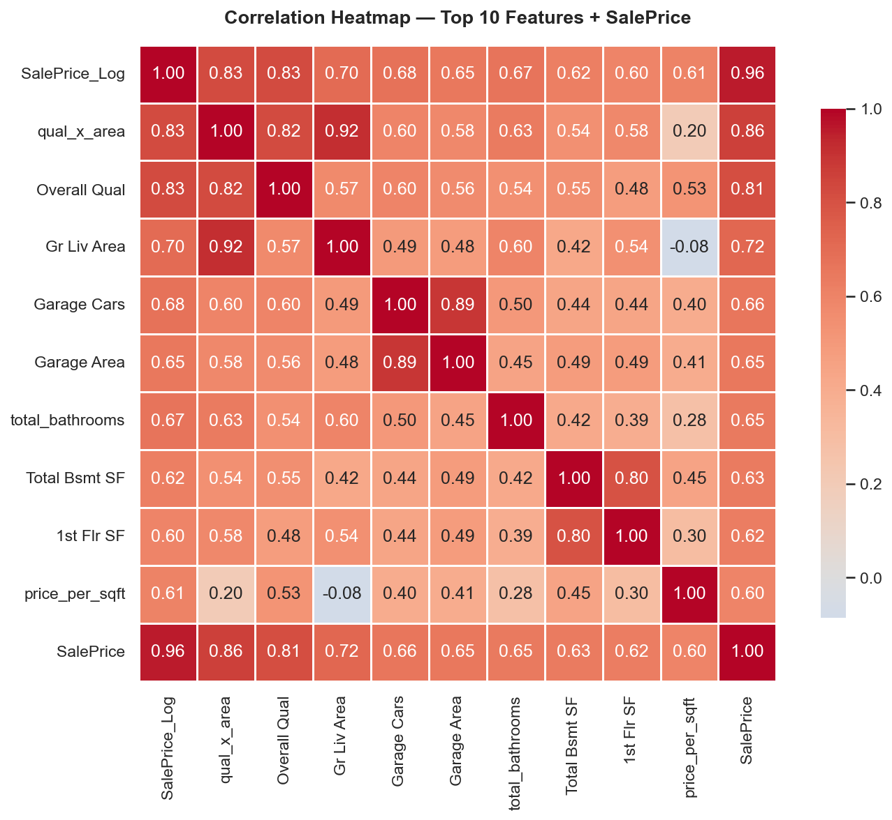

# Capstone Report — Ames Housing Data Analysis
**ML Foundations Bootcamp**

**Student:** Khaled Waleed Althobaiti | خالد وليد الثبيتي  
**Class:** 1/1 | صف 1/1

---

## 1. Introduction

### Dataset
For this project I chose the **Ames Housing Dataset** — 2,930 house sales in Ames, Iowa from 2006 to 2010. It has 82 columns covering lot details, building features, quality ratings, neighbourhood, and final sale price. I picked it because it has a good mix of numerical and categorical columns and a lot of messiness to clean up.

### Questions I Wanted to Answer
1. Which features are most strongly linked to sale price?
2. How much does neighbourhood alone explain the price difference between homes?
3. Does combining quality and size into one feature work better than using them separately?
4. What percentage of high-quality homes actually sell above the median price?

---

## 2. Cleaning Summary

### Problems I Found

| Problem | How Many | What I Did |
|---|---|---|
| Missing values across 33 columns | 15,749 total | Different strategy per column (see below) |
| `MS SubClass`, `Mo Sold`, `Yr Sold` stored as integers | 3 columns | Converted to strings — they are codes not real numbers |
| Duplicate rows | 0 | Nothing needed |
| Very high outliers in `SalePrice` | ~30 rows | Capped at 99th percentile |
| Extreme values in `Gr Liv Area` | ~5 rows | Capped at Q3 + 3×IQR |

### How I Handled Missing Values

Most of the missing values were not really "missing" — they just meant the feature did not exist in that house. For example, `Pool QC` is null because the house has no pool, not because someone forgot to fill it in. I filled those with `'None'` or `0`.

- Columns like Pool QC, Fireplace Qu, Alley, Fence, all Garage and Basement quality columns → filled with `'None'` or `0`
- `Lot Frontage` → filled with the median for that neighbourhood, since lot size tends to be similar within a neighbourhood
- `Electrical` → filled with the mode since only 1 row was missing

All of these steps are inside a `clean_data()` function that I can call on any fresh copy of the raw data. At the end I added three checks to confirm the cleaning worked correctly.

---

## 3. Feature Engineering Summary

### New Features I Created

| Feature | Type | How I Made It | Why I Thought It Would Help |
|---|---|---|---|
| `price_per_sqft` | Ratio | SalePrice ÷ Gr Liv Area | Normalises price by size so homes of different sizes are comparable |
| `total_bathrooms` | Aggregate | All bath counts combined (full = 1, half = 0.5) | Simpler than four separate columns |
| `qual_x_area` | Interaction | Overall Qual × Gr Liv Area | A big high-quality house should be worth a lot more than the sum of its parts |
| `SalePrice_Log` | Log transform | np.log1p(SalePrice) | The target was right-skewed, log made it much more symmetric |
| `house_age_group` | Bin | Year Built split into 5 eras | Easier to interpret than exact build year |

### Encoding and Scaling

- One-hot encoded `MS Zoning` and `Sale Condition` since they have no natural order
- Ordinal encoded five quality columns (Poor=1 through Excellent=5) to preserve the ranking
- Standard scaled `Gr Liv Area` and `Lot Area` to use in the cosine similarity calculation
- Dropped columns where r > 0.95 with another column since they carry the same information

---

## 4. Key Findings

### Finding 1 — Quality is the strongest predictor of price

Overall quality had the highest correlation with sale price (r ≈ 0.80) out of all original features. The interaction feature `qual_x_area` I created scored even higher at r ≈ 0.82, which shows that combining quality and size captures something neither column does alone. The boxplot also shows clearly that each step up in quality adds a lot to the median price — quality 9 homes sell for about 4 times more than quality 5 homes.

### Finding 2 — Neighbourhood creates a 3.5× price gap

The average sale price ranges from $95,756 in MeadowV to $330,319 in NoRidge. That gap comes purely from location — nothing about the house itself. This means any model that leaves out neighbourhood is missing one of the biggest factors in pricing.

### Finding 3 — High-quality homes almost always sell above median

I calculated the probability that a home with Overall Qual ≥ 8 sells above the overall median price ($160,000). The answer was 98.6%. That means quality is not just correlated with price — if a home is high quality it almost certainly sells above average. Only about 50% of all homes do the same.

---

## 5. What I Would Do Next

1. **Build a model** — the cleaned and engineered data is ready. A linear regression would be a good starting point to see how well the top features predict price.
2. **Encode neighbourhood more carefully** — one-hot encoding creates 27 binary columns. Target-mean encoding would be more compact and might work better.
3. **Look at the 2006–2010 period** — this dataset covers the housing market crash. Grouping by year sold and comparing distributions would show how much prices dropped.
4. **Rank all features by importance** — using a random forest to score every feature would help decide which ones to keep and which to drop before modelling.

---

*Analysis done in Python using pandas, NumPy, matplotlib, seaborn, and scikit-learn. Full code in notebooks/01_cleaning.ipynb, 02_features.ipynb, and 03_eda.ipynb.*
